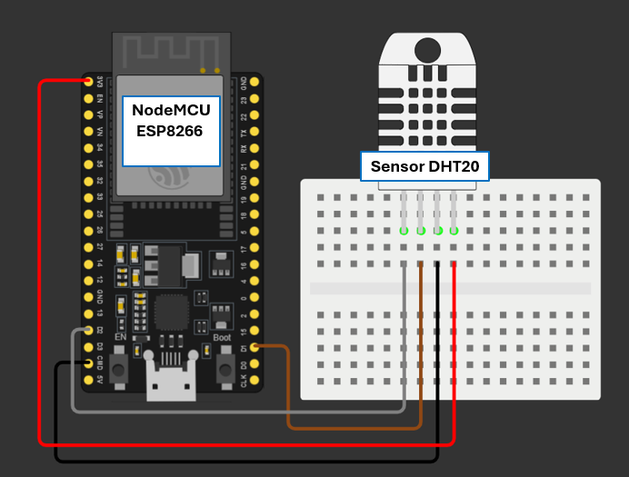

# WeatherPulse-IoT 🌤️📡

**WeatherPulse-IoT** ist ein Ende-zu-Ende IoT-Wetterüberwachungssystem mit automatisierter Plausibilitätsprüfung und einem modernen Live-Dashboard im Dark-Mode. Das System erfasst lokale Messwerte über ein NodeMCU (ESP8266) Board mit DHT20-Sensor, validiert diese serverseitig in Echtzeit gegen historische Daten sowie Referenzdaten der **Open-Meteo API** (Bad Waldsee) und visualisiert die Ergebnisse interaktiv.

---

## 🛠️ Hardware-Aufbau & Verkabelung

Das nachfolgende Anschlussdiagramm zeigt den genauen Aufbau des IoT-Messknotens:



### Komponenten:
- **Mikrocontroller:** NodeMCU V3 (ESP8266)
- **Sensor:** DHT20 (I²C Temperatur- und Luftfeuchtigkeitssensor)
- **Steckplatine & Jumper Wire**

### Pin-Belegung (I²C Schnittstelle):
| DHT20 Sensor Pin | NodeMCU Pin | Funktion | Drahtfarbe (im Diagramm) |
| :--- | :--- | :--- | :--- |
| **Pin 1 (VDD)** | `3V3` | Stromversorgung | Rot 🔴 |
| **Pin 2 (SDA)** | `D2` (GPIO4) | I²C Data Line | Grau ⚪ |
| **Pin 3 (GND)** | `GND` | Masse | Schwarz ⚫ |
| **Pin 4 (SCL)** | `D1` (GPIO5) | I²C Clock Line | Braun 🟤 |

---

## 🏗️ Systemarchitektur

```text
  [ DHT20 Sensor ]
         │ (I²C)
  [ ESP8266 NodeMCU ] ──(HTTP POST / 60s)──► [ FastAPI Backend ]
                                                    │
                                     ┌──────────────┴──────────────┐
                                     ▼                             ▼
                          [ Plausibilitäts-Engine ]      [ Open-Meteo API ]
                                     │ (Validierung)      (Bad Waldsee Ref.)
                                     └──────────────┬──────────────┘
                                                    ▼
                                          [ Live Dark Dashboard ]
                                          (Tailwind & Chart.js)
```
1. **Firmware (`firmware/`):** C++ / PlatformIO – Liest den DHT20-Sensor alle 60 Sekunden aus und überträgt Temperatur- sowie Luftfeuchtewerte via JSON-Payload per HTTP POST an den Backend-Server.
2. **Backend (`backend/`):** FastAPI (Python) – Verwaltet die Endpunkte, cached Open-Meteo Referenzdaten (`requests-cache`) und führt Plausibilitätsprüfungen durch.
3. **Plausibilitäts-Engine:**
   - **Grenzwerte:** Prüfung auf extreme Werte (Temperatur: -30°C bis 60°C; Feuchtigkeit: 0% bis 100%).
   - **Sprungerkennung:** Identifiziert plötzliche Messwertanstiege (ΔT > 10°C/min).
   - **API-Abgleich:** Vergleicht lokale Messwerte direkt mit der Open-Meteo Referenz für Bad Waldsee (ΔT > 5°C erzeugt Warnhinweis).
4. **Frontend (`backend/static/`):** HTML5, Tailwind CSS & Chart.js – Responsive Dark-Mode Dashboard mit Live-Status, Fehler-Badges und synchronisiertem Temperaturverlauf.

---

## 🚦 Entwicklungsstatus

- [x] **Phase 1: Hardware & Firmware** – Einbindung des DHT20 via I²C und stabile Wi-Fi-Übertragung per ESP8266.
- [x] **Phase 2: FastAPI Backend & API-Integration** – Grundgerüst, Open-Meteo Anbindung mit Cache/Retry.
- [x] **Phase 3: Plausibilitätsprüfung & Unit-Tests** – Ausführliche Testsuite mit `pytest` (5/5 Tests bestanden).
- [x] **Phase 4: Live Frontend Dashboard** – Auto-Polling, Dark-Mode Layout, Offline-Erkennung & Chart.js Visualisierung.
- [ ] **Phase 5: Persistenz & Alerting** – Datenbank-Anbindung und Benachrichtigungssystem.

---

## 🚀 Schnellstart & Installation

### 1. Backend starten
Voraussetzung: Python 3.10+ installiert.

```bash
# In den Backend-Ordner wechseln
cd backend

# Virtuelle Umgebung aktivieren (Windows Git Bash / Bash)
source venv/Scripts/activate   # Unter Linux/macOS: source venv/bin/activate

# Server starten
uvicorn main:app --reload --host 0.0.0.0 --port 8000
```
### 2. Dashboard öffnen
Öffne nach dem Start den Browser unter:  
👉 **`http://localhost:8000`**

### 3. Unit-Tests ausführen
Um die Plausibilitäts-Engine und die API-Routen zu überprüfen:

```bash
cd backend
pytest -v
```
---

## 📁 Projektstruktur

WeatherPulse-IoT/
├── backend/
│   ├── main.py              # FastAPI Server & Plausibilitätslogik
│   ├── test_main.py         # Pytest Unit-Testsuite
│   ├── static/
│   │   └── index.html       # Dashboard UI (Tailwind CSS, Chart.js)
│   └── venv/                # Python Virtual Environment
├── firmware/
│   ├── src/
│   │   └── main.cpp         # ESP8266 C++ Code (PlatformIO)
│   └── platformio.ini       # PlatformIO Konfiguration
├── hardware_schema.png      # Anschlussdiagramm
└── README.md                # Dokumentation

