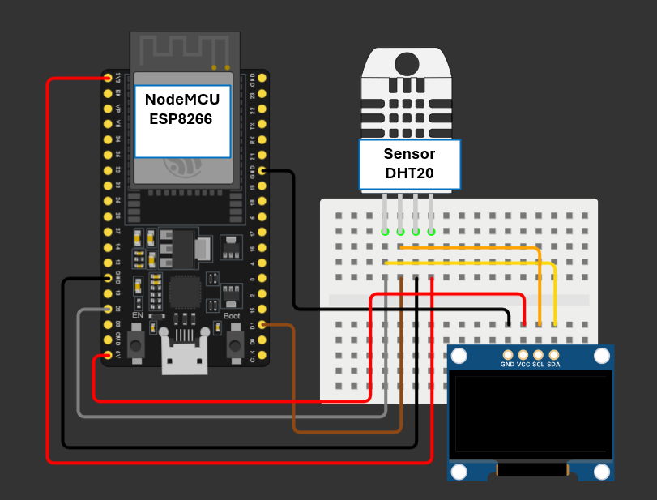

# WeatherPulse-IoT 🌤️📡

**WeatherPulse-IoT** ist ein Ende-zu-Ende IoT-Wetterüberwachungssystem mit automatisierter Plausibilitätsprüfung, lokalem OLED-Display und einem modernen Live-Dashboard im Dark-Mode. Das System erfasst lokale Messwerte über ein NodeMCU (ESP8266) Board mit DHT20-Sensor, zeigt diese direkt auf einem SH1106 OLED-Display an, validiert sie serverseitig in Echtzeit gegen historische Daten sowie Referenzdaten der **Open-Meteo API** (Bad Waldsee) und visualisiert die Ergebnisse interaktiv.

---

## 🛠️ Hardware-Aufbau & Verkabelung

Das nachfolgende Anschlussdiagramm zeigt den genauen Aufbau des IoT-Messknotens inklusive Sensorik und Display:




### Komponenten:
- **Mikrocontroller:** NodeMCU V3 (ESP8266)
- **Sensor:** DHT20 (I²C Temperatur- und Luftfeuchtigkeitssensor)
- **Display:** 1.3" SH1106 OLED Display (I²C, 128x64)
- **Steckplatine & Jumper Wire**

### Pin-Belegung (I²C Bus):
Beide I²C-Geräte (DHT20 & OLED) teilen sich die Bus-Leitungen **SDA** (GPIO4 / D2) und **SCL** (GPIO5 / D1):

| Komponente | Pin | NodeMCU Pin | Funktion | Drahtfarbe (im Diagramm) |
| :--- | :--- | :--- | :--- | :--- |
| **DHT20 Sensor** | Pin 1 (VDD) | `3V3` | Stromversorgung (3.3V) | Rot 🔴 |
| | Pin 2 (SDA) | `D2` (GPIO4) | I²C Data Line | Grau ⚪ |
| | Pin 3 (GND) | `GND` | Masse | Schwarz ⚫ |
| | Pin 4 (SCL) | `D1` (GPIO5) | I²C Clock Line | Braun 🟤 |
| **SH1106 OLED** | GND | `GND` | Masse | Schwarz ⚫ |
| | VCC | `3V3` | Stromversorgung (3.3V) | Rot 🔴 |
| | SCL | `D1` (GPIO5) | I²C Clock Line | Gelb 🟡 |
| | SDA | `D2` (GPIO4) | I²C Data Line | Orange 🟠 |

---

## 🏗️ Systemarchitektur & Deployment

```text
  [ DHT20 Sensor ] ──(I²C)──► [ ESP8266 NodeMCU ] ──(I²C)──► [ SH1106 OLED Display ]
                                    │
                             (HTTP POST / 60s)
                                    │
                                    ▼
                          [ FastAPI Backend ]
                          (AWS ECS Container)
                                    │
                   ┌────────────────┴────────────────┐
                   ▼                                 ▼
        [ Plausibilitäts-Engine ]          [ Open-Meteo API ]
             (Validierung)                (Bad Waldsee Ref.)
                   └────────────────┬────────────────┘
                                    ▼
                         [ Live Dark Dashboard ]
                          (Tailwind & Chart.js)
```
1. **Firmware (`firmware/`):** C++ / PlatformIO – Liest den DHT20-Sensor alle 60 Sekunden aus und überträgt Temperatur- sowie Luftfeuchtewerte via JSON-Payload per HTTP POST an den Backend-Server.
2. **Backend (`backend/`):** FastAPI (Python) – Verwaltet die Endpunkte, cached Open-Meteo Referenzdaten (`requests-cache`) und führt Plausibilitätsprüfungen durch.
3. **Plausibilitäts-Engine:**
   - **Grenzwerte:** Prüfung auf extreme Werte (Temperatur: -30°C bis 60°C; Feuchtigkeit: 0% bis 100%).
   - **Sprungerkennung:** Identifiziert plötzliche Messwertanstiege (ΔT > 10°C/min).
   - **API-Abgleich:** Vergleicht lokale Messwerte direkt mit der Open-Meteo Referenz für Bad Waldsee (ΔT > 5°C erzeugt Warnhinweis).
4. **Frontend (`backend/static/`):** HTML5, Tailwind CSS & Chart.js – Responsive Dark-Mode Dashboard mit Live-Status, Fehler-Badges und synchronisiertem Temperaturverlauf.
5. **CI/CD Pipeline (.github/workflows/deploy.yml):** Automatisierter Workflow mit GitHub Actions:
    - **PlatformIO Firmware Check**
    - **Pytest Unit-Testsuite Execution**
    - **Docker Container Build & Push zu Amazon ECR**
    - **Automatisiertes Deployment zu AWS ECS**

---

## 🚦 Entwicklungsstatus

- [x] **Phase 1: Hardware & Firmware** – Einbindung des DHT20 via I²C und stabile Wi-Fi-Übertragung per ESP8266.
- [x] **Phase 2: FastAPI Backend & API-Integration** – Grundgerüst, Open-Meteo Anbindung mit Cache/Retry.
- [x] **Phase 3: Plausibilitätsprüfung & Unit-Tests** – Ausführliche Testsuite mit `pytest` (5/5 Tests bestanden).
- [x] **Phase 4: Live Frontend Dashboard** – Auto-Polling, Dark-Mode Layout, Offline-Erkennung & Chart.js Visualisierung.
- [x] **Phase 5: CI/CD & Cloud Deployment** – Dockerization & automatisierte Deployment-Pipeline via GitHub Actions zu AWS ECS.
- [ ] **Phase 6: Persistenz & Alerting** – Datenbank-Anbindung und Benachrichtigungssystem.

---

## 🚀 Schnellstart & Installation

### 1. Backend starten
Voraussetzung: Python 3.10+ installiert.

```bash
# In den Backend-Ordner wechseln
cd backend

# Virtuelle Umgebung aktivieren (Windows Git Bash / Bash)
source venv/Scripts/activate   # Unter Linux/macOS: source venv/bin/activate

# Server starten
uvicorn main:app --reload --host 0.0.0.0 --port 8000
```
### 2. Dashboard öffnen
Öffne nach dem Start den Browser unter:  
👉 **`http://localhost:8000`**

### 3. Unit-Tests ausführen
Um die Plausibilitäts-Engine und die API-Routen zu überprüfen:

```bash
cd backend
pytest -v
```
---

## 📁 Projektstruktur

```text
WeatherPulse-IoT/
├── 📂 .github/
│   └── 📂 workflows/
│       └── 📄 deploy.yml           # GitHub Actions CI/CD Pipeline (Test & AWS Deployment)
├── 📂 backend/
│   ├── 📂 static/
│   │   └── 📄 index.html          # Dashboard UI (Tailwind CSS & Chart.js)
│   ├── 📄 Dockerfile              # Docker Containerisierung für AWS ECS
│   ├── 📄 main.py                 # FastAPI Server & Plausibilitätslogik
│   ├── 📄 requirements.txt        # Python Abhängigkeiten
│   └── 📄 test_main.py            # Pytest Unit-Testsuite (Python 3.14+ kompatibel)
├── 📂 firmware/
│   ├── 📂 src/
│   │   └── 📄 main.cpp            # ESP8266 C++ Firmware (DHT20, OLED & HTTP POST)
│   └── 📄 platformio.ini          # PlatformIO Projekt-Konfiguration
├── 📄 .dockerignore               # Ausschlüsse für Docker Builds
├── 🖼️ weatherpulse_iot_
|      hardware_schema.png          # Hardware-Schaltplan mit ESP8266, DHT20 & OLED
└── 📄 README.md                   # Projektdokumentation
```

